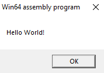
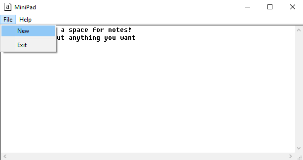
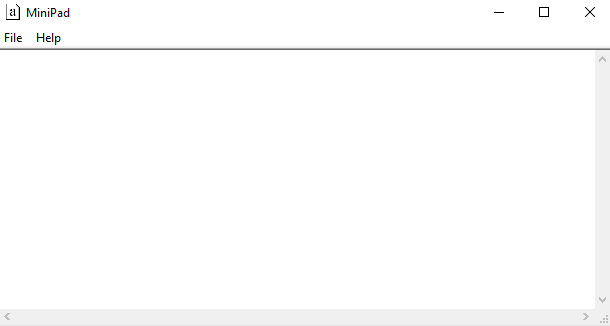

# Assembler

Пример 1: Hello world

Данная программа(Hello World в папке Seminar1) создает окно с надписью Hello World!

Пример 2: Создание диалогового окна

Данная программа(Creating message box в папке Seminar1) предлагает пользователю создать диалоговое окно, позволяя выбрать иконку и ввести текст

Диалоговое окно для введения данных

Сконфигурируем собственное окно, выбрав параметры, и введем текст

Полученное диалоговое окно

Пример 3: MiniPad

Данная программа(MiniPad в папке Seminar1) представляет собой диалоговое окно с текстовым редактором. Пользователь может ввсети свой текс и создань новый чистый лист

Введем текст в поле редактора

Создадим новый чистый лист

Поле текстового редактора очистилось

Также в верхней панели есть кнопка About

При нажатии на нее появится диалоговое окно с информацией о программе

Пример 4: Иконка на панели быстрого доступа

Данная программа(Tab bar icon в папке Seminar1) позволяет скрывать и показывать иконку исполняемого файла в панели быстрого доступа

Изначально иконка программы показывается в панели быстрого доступа

Но стоит нам нажать кнопку Hide и иконка скроется

Если нажать на кнопку Show, иконка снова появится

Пример 5: Генератор простых чисел

Данная программа(Prime Numbers Generator в папке Seminar1) генерирует простые числа от 3 до 65536 и выводит их в поле диалогового окна

Диалоговое окно, которое появляется при запуске. При нажатии на кнопку CALC начнется процесс генерации и вывода

Результат работы программы. Огромное количество простых чисел на экране

