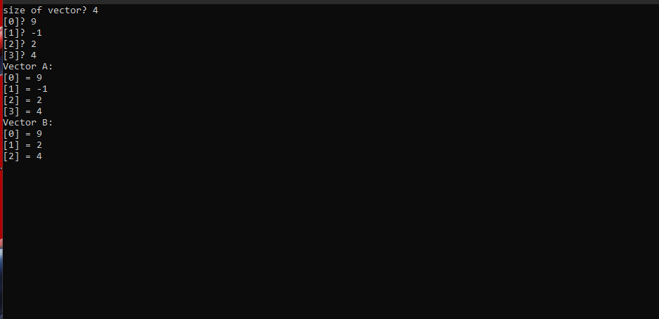
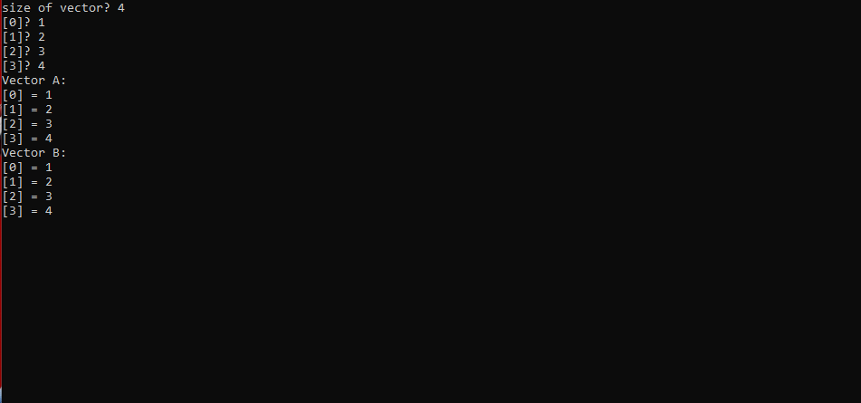
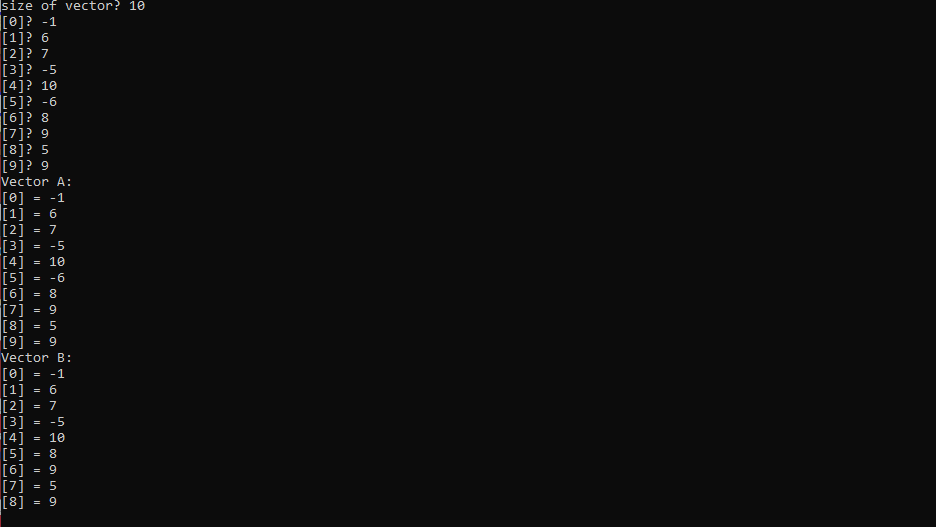

# Семинар 2

Программа считывает длину массива, а затем и сам массив. На его основе создаётся новый массив, в который не входит последний отрицательный элемент исходного.

Результат работы при одном отрицательном элементе

Результат работы при отсутствии отрицательных элементов

Результат работы при нескольких отрицательных элементах

